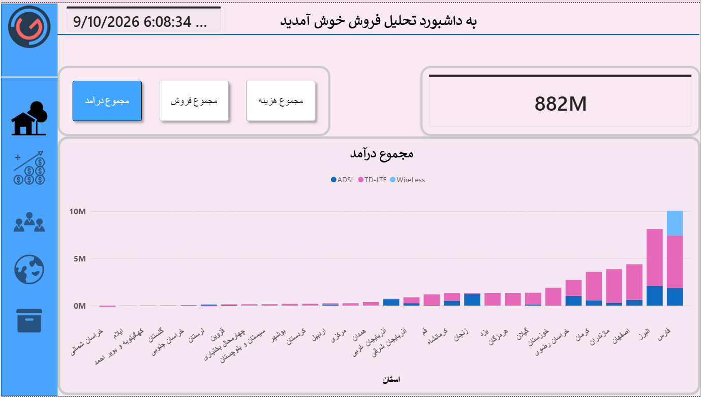
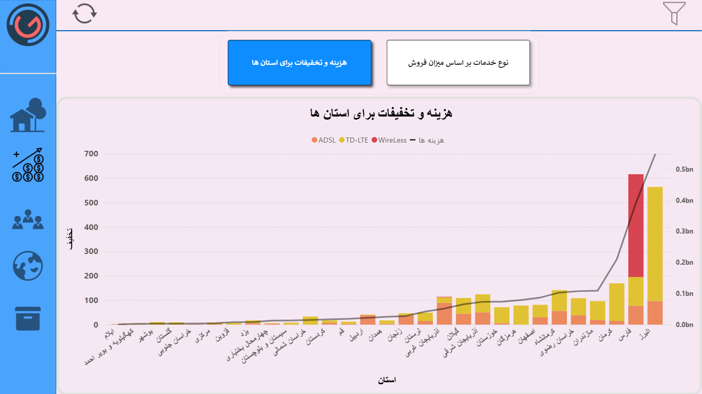
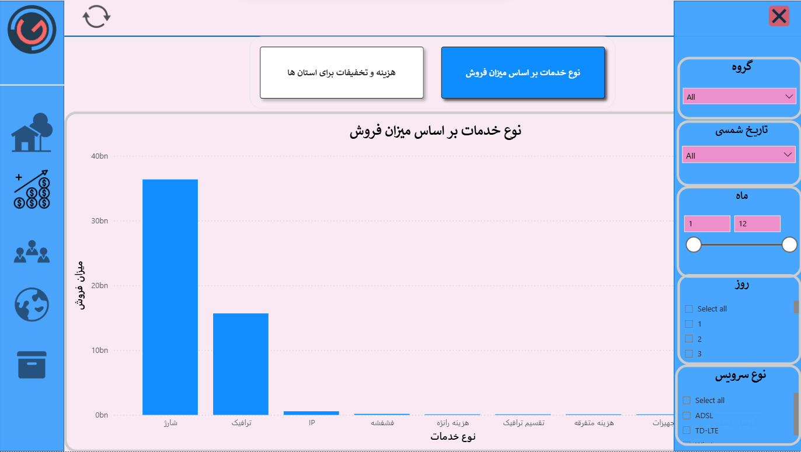
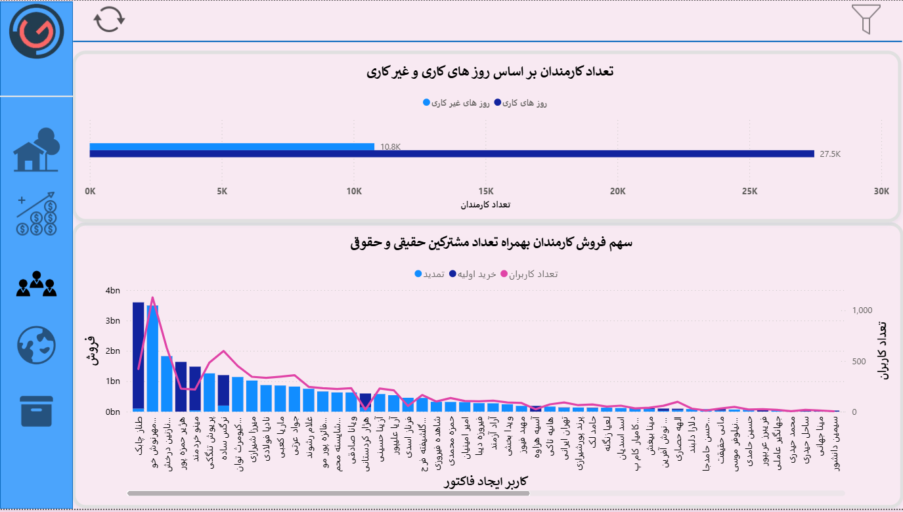
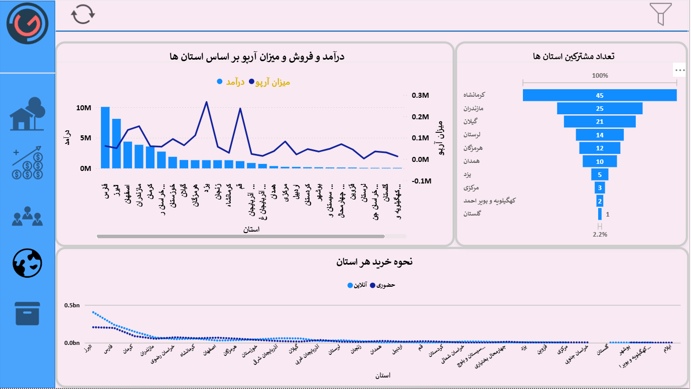
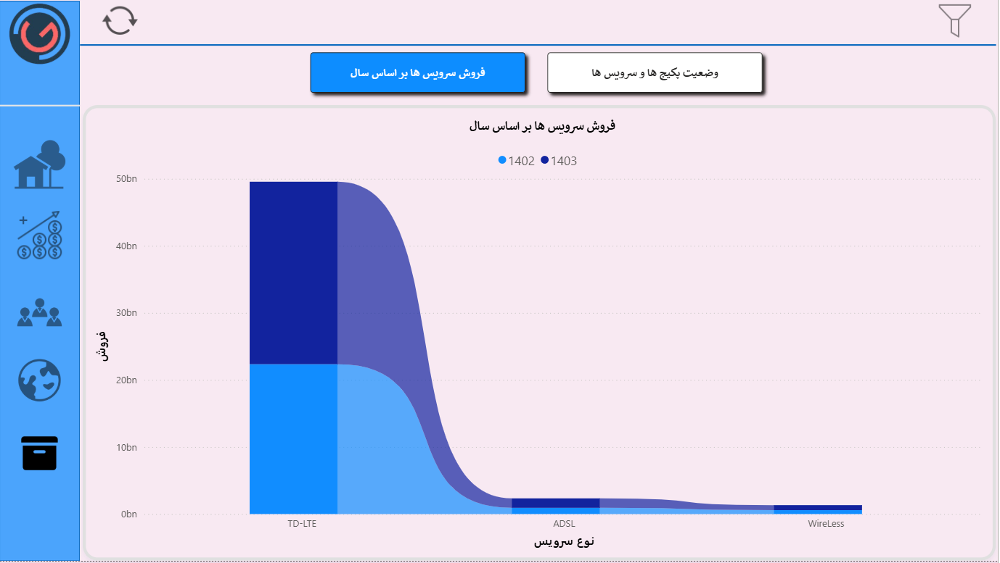
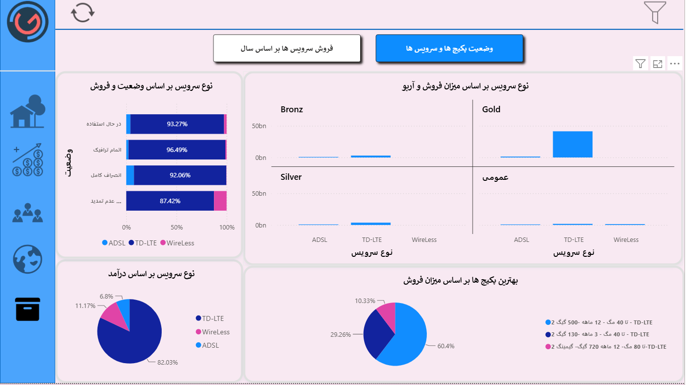

# 📊 Sales & Business Intelligence Dashboard

An interactive Power BI dashboard designed to analyze sales performance, revenue, costs, customers, employees, services, and regional business performance.

The project focuses on transforming sales data into actionable business insights through interactive visualizations, dynamic KPIs, DAX measures, and multi-dimensional analysis.

---

## 🎯 Project Objectives

The main goal of this project was to provide a comprehensive view of business performance and help answer key questions such as:

* How are sales, revenue, and costs performing?
* Which provinces generate the highest sales and revenue?
* Which services and packages perform best?
* How does ARPU vary across provinces and services?
* What is the contribution of employees to overall sales?
* How are individual and corporate customers distributed?
* How do purchasing patterns differ across provinces?
* How do sales and service performance change over time?

---

## 🛠️ Tools & Technologies

* **Power BI**
* **DAX**
* **Power Query**
* **Data Modeling**
* **Data Visualization**
* **Business Intelligence**
* **Business Analysis**

---

# 📈 Dashboard Pages

## 1. Executive Sales Overview

The first page provides a high-level overview of business performance.

### Key metrics:

* Total Revenue
* Total Sales
* Total Costs

Dynamic measures were used to allow the main KPIs to respond interactively to the selected filters.

The page also provides sales analysis by:

* Province
* Service Type

---

## 2. Sales & Cost Analysis

This page focuses on a deeper analysis of sales, costs, and discounts.

Visualizations include:

* Sales by Service Type
* Costs by Province
* Discounts by Province

This view helps identify differences in service performance and regional cost and discount patterns.

---

## 3. Employee & Customer Analysis

This page analyzes employee performance and customer composition.

The dashboard includes:

* Number of Employees by Working Day and Non-Working Day
* Employee Contribution to Total Sales
* Individual Customers
* Corporate Customers

Separate visualizations were used to compare employee activity and customer types.

---

## 4. Provincial Sales Analysis

This page provides a detailed analysis of sales performance across provinces.

Key metrics and visualizations include:

* Revenue by Province
* Sales by Province
* ARPU by Province
* Number of Subscribers by Province
* Purchasing Method by Province

This page helps identify regional differences in sales performance, customer base, and purchasing behavior.

---

## 5. Product & Service Analysis

The final page focuses on product and service performance.

The analysis includes:

* Service Type by Status and Sales
* Service Type by Revenue
* Best-Performing Packages by Sales
* Service Type by Sales and ARPU
* Service Sales by Year

This page provides a detailed view of which services and packages contribute most to business performance.

---

# 🎛️ Interactive Filters

Interactive filters are available throughout the dashboard to allow users to explore the data from different perspectives.

### Available Filters

* Day
* Month
* Year
* Gender
* Usage Type
* Service Type

The dashboard also includes refresh functionality to keep the analysis up to date with the underlying data.

---

# 🧮 DAX & Data Modeling

DAX measures were developed to calculate and analyze key business metrics, including:

* Total Sales
* Total Revenue
* Total Costs
* Average Product Sales
* ARPU
* Dynamic Measures

Dynamic measures were used to make the dashboard more interactive and allow users to analyze different KPIs through the same visual elements.

---

## 📅 Persian Calendar

A dedicated Date/Calendar table was created to support time-based analysis and Persian (Jalali) date reporting.

The calendar table was connected to the relevant business tables and used for:

* Day-level analysis
* Monthly analysis
* Yearly analysis
* Time-based filtering

This allowed the dashboard to support Persian date-based reporting and analysis.

---

# 📌 Key BI Skills Demonstrated

* Data Analysis
* Business Intelligence
* Data Modeling
* DAX
* Power BI
* KPI Development
* Dynamic Measures
* Time Intelligence
* Data Visualization
* Regional Analysis
* Customer Analysis
* Employee Performance Analysis
* Product & Service Analysis
* Business Performance Analysis

---

# 💡 Business Value

The dashboard provides a centralized view of sales and business performance, helping users identify regional trends, evaluate service and package performance, monitor key financial metrics, and understand customer and employee patterns.

The combination of interactive filters, dynamic KPIs, DAX measures, and multi-dimensional analysis enables users to move from high-level business performance to detailed operational insights.

---

## 📷 Dashboard Preview

### Executive Overview



### Sales & Cost Analysis




### Employee & Customer Analysis



### Provincial Analysis



### Product & Service Analysis




---

## 📁 Project Structure

```text
sales-business-intelligence-dashboard/
│
├── README.md
│
├── dashboard/
│   └── Sales_BI_Dashboard.pbix
│
├── screenshots/
    ├── overview.png
    ├── sales-analysis-1.png
    ├── sales-analysis-2.png
    ├── employee-customer-analysis.png
    ├── provincial-analysis.png
    └── product-service-analysis-1.png
    └── product-service-analysis-2.png

```

